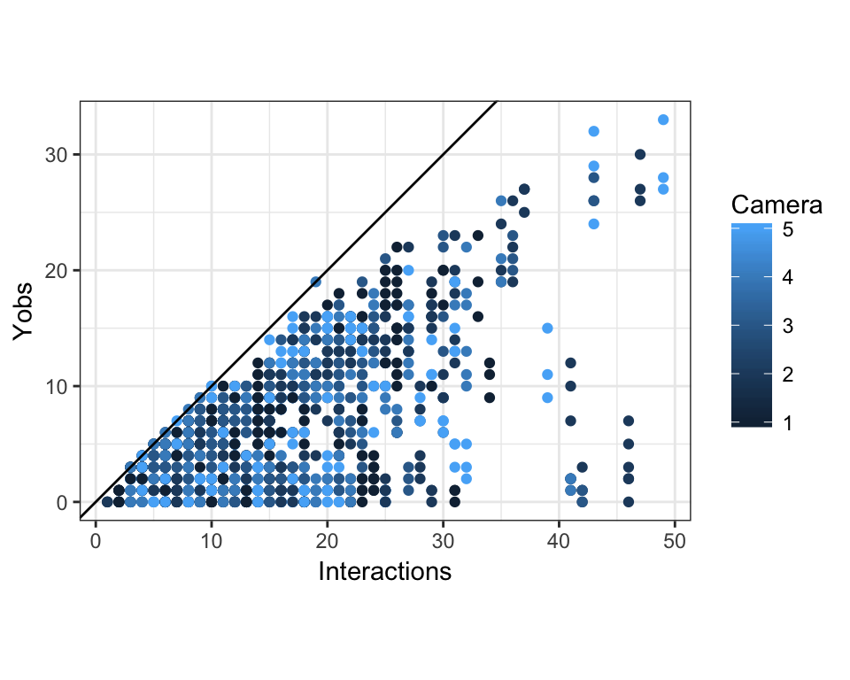

# Trait-matching simulation
Ben Weinstein  


#Simulation   

## Parameters

* 10 hummingbird species
* 10 resource species
* Range of hummingbird bill sizes (in mm) ~ Pois(10)/10
* Range of corolla sizes (in mm) ~ Pois(15)/10
* Mean frequency ($\lambda$) for each hummingbird is drawn from U(0,10)  
* Trait matching (minimizing Bill-Corolla difference) is drawn from a hierarcichal distribution
$$log(\lambda)<-\alpha_i + \beta_i *traitmatch$$
$$\alpha=N(3,0.2)$$
$$\beta1 = N(-1,0.2)$$

* Imperfect detection 
* $$ p_i = U(0.1,0.9) $$ 
* 10 camera
* 3 days per camera

**View simulated strength and form of trait matching **

#Simulation Parameters


```r
#Number of consumer species
h_species=10
plant_species=10
cameras<-5
days<-3

#Bill sizes
Bill<-rpois(h_species,10)

#Corolla sizes
Corolla<-rpois(plant_species,15)

#Subtract both and take absolute value, convert cm
traitmatch<-abs(sapply(Corolla,function(x) x - Bill)/10)
  
#regression slopes
#traits
beta1_mu<- -1

#abundance

#species variance in slopes
beta1_sigma<- 0.2

#Species alpha_mu 
alpha_mu<- 3
alpha_sigma<- 0.2

#Poisson overdipersion
tauE<-10

#species level
detection= inv.logit(rnorm(h_species,0,1.67))
beta1<-rnorm(h_species,beta1_mu,beta1_sigma)
alpha<-rnorm(h_species,alpha_mu,alpha_sigma)
```

#Compute true interaction matrices


```r
#for each species loop through and create a replicate dataframe
obs<-array(dim=c(h_species,plant_species,cameras,days))
lambda<-array(dim=c(h_species,plant_species,cameras))
N<-array(dim=c(h_species,plant_species,cameras))

#create intensities
for(x in 1:h_species){
  for (y in 1:plant_species){
    for (z in 1:cameras){
      lambda[x,y,z]<-exp(alpha[x] + beta1[x] * traitmatch[x,y] + rnorm(1,0,1/sqrt(tauE)))
  }
  }
}


#draw latent states
for(x in 1:h_species){
  for (y in 1:plant_species){
    for (z in 1:cameras){
      # true latent count
      N[x,y,z]<-rpois(1,lambda[x,y,z])
    }
  }
}

#Observed counts in each day
for(x in 1:h_species){
  for (y in 1:plant_species){
    for (z in 1:cameras){
        for (d in 1:days){
      #true detection rate of that observed count
      obs[x,y,z,d]<-rbinom(1,N[x,y,z],p=detection[x])
      }
    }
  }
}
```

##View correlation in simulated latent state


```r
mdat<-melt(N)
colnames(mdat)<-c("Bird","Plant","Camera","Interactions")

traitmelt<-melt(traitmatch)
colnames(traitmelt)<-c("Bird","Plant","traitmatch")

mdat<-merge(mdat,traitmelt,c("Bird","Plant"))
ggplot(mdat,aes(x=traitmatch,y=Interactions,col=as.factor(Bird))) + geom_point() + geom_smooth(aes(group=1),method="glm",method.args = list(family = "poisson")) + labs(col="Bird") + xlab("Absolute value of Bill Length - Corolla Length ")
```


##View Detection Rates


```r
obs.state<-melt(obs)
colnames(obs.state)<-c("Bird","Plant","Camera","Day","Yobs")
obs.state<-merge(mdat,obs.state,by=c("Bird","Plant","Camera"))
ggplot(obs.state,aes(x=Interactions,y=Yobs,col=Camera)) + geom_point() + theme_bw() + geom_abline() + coord_equal()
```



