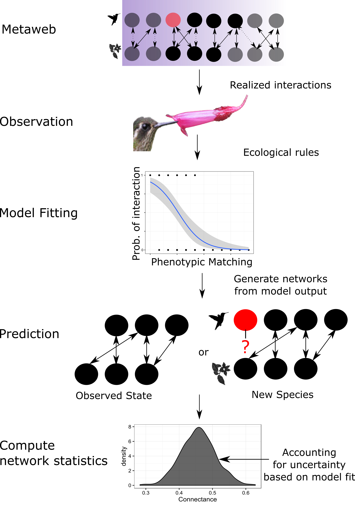

#Title:

* Inferring species interactions from ecological data
* A quantitative comparison of methods for Inferring species interactions from ecological data
* Comparing inferences for species interactions from ecological data
* On the use of ecological data for comparing species interactions
* Comparing methods for inferring species interactions
* A statistical analysis of methods for inferring species interactions.
* ?

#Authors* 
* Ignasi Bartomeus
* Kevin Cazelles
* Guillaume Blanchet
* Mickaël Hedde
* Ignacio Morales Castilla
* Mathilde Besson 
* David Beauchesne
* Dominique Gravel
* Timothée Poisot
* Ben Weinstein
* Steve Vissault 

_Current author order drawn from a multinomial distribution, which, ironically, might be the only acceptable use case for this distribution in this manuscript._

_Target Journals_: Methods in Ecology and Evolution, Ecological Monographs, Annual Review of Ecology, Evolution, and Systematics.

#Introduction
Biotic interactions form the backbone of biodiversity (Bascompte & Jordano 2007). Understanding the strength, direction, and symmetry of species interactions provides insights into the maintenance of assemblages and potential threats from anthropogenic change. Combined with abiotic factors, biotic interactions constrain the distributions of species, shape the evolution of phenotypes, and influence the stability of natural systems (Schleuning et al. 2015). A common tool for understanding interaction is ecological networks, in which each species (nodes) are connected based on the strength and direction of interactions (links)(Jordano 1987). Documenting and analyzing these networks is essential to understanding the rules underlying pairwise species interactions (Bascompte et al. 2006), quantifying ecosystem functioning (Thomson et al 2012), and predicting the biodiversity consequences due to anthropogenic change (ref).

  Species traits are at the core of biological interactions (Bartomeus et al. 2016). We define traits broadly as phenotypic adaptations to exploit abiotic or biotic resources. We use traits as our principal mechanism to explain when species can interact. The foremost requirement for species interaction is species co-occurrence, which is itself driven by traits through environmental filtering and local adaptation (Hillerislambers, Mayfield, but see Kraft). If species co-occur, they may interact if their respective traits promote the efficiency of resource extraction. In addition, traits can be represented by phylogenetic information, in which evolution history constrains trait evolution either directly through phylogenetic conservatism or indirectly through exposure to similiar environmental conditions (Graham and Wiens 2005). 
  
  The traits promoting species co-occurrence and interaction may be hidden from us, either through lack of sampling, or due to their complexity. In these cases, the co-occurrence of species is used as a proxy for interaction. Given the correlation in distribution or abundance of species across space or time, co-occurrence based methods attempt to circumvent trait-based models by assuming that species which consistently co-occur, and whose populations co-vary, may have important biotic interactions. We therefore see co-occurrence based methods as an extension of specific trait-based models when the mechanisms promoting interactions are unknown or unobserved.

  In spite of increasing efforts, it is unlikely that ecologists will empirically document the enormous number of interactions existing in nature (Morales-Castilla et al. 2015). Therefore, complementing field work with models of species interactions is a promising avenue for understanding the complexity of the natural world(ref). While direct inference will often be preferable, many interactions are rare, infrequent, or impossible to detect by human observation. Model-based inference for ecological networks provides three important aspects, i) it establishes mechanistic relationships among species, ii) it estimates uncertainty given empirical observation, and iii) it provides an avenue to predict future interactions. We follow Poisot (2015) and Cazelles (2016) in formulating our general conceptual model of species interactions (Fig. 1). There is a pool of potential interactions, termed a metaweb, in which species could interact based on co-occurrence. Any given observation we make is an attempt to recover these relationships using empirical data. We use these data to fit a model based on either species taxonomic identity or phenotypic characteristics. This model can used to predict the interactions among observed species, given the uncertainty due to spatial and temporal stochasticity of interactions, or a new network, based on the presence of a novel species in the assemblage. From these predictions, we can estimate structural network properties, such as connectance and nestedness, while simultaneously propagating our uncertainty throughout the analysis. In this paper, we review the methods proposed to build models of species interactions, emphasizing each method’s utility for predicting the position of a novel species in the network. 

  From this conceptual framework, we can decide on a set of optimal criteria to compare existing models. While there is unlikely to be any single method that meets all our expectations, by defining a set of standards, we can more transparently judge the relative merits of each method for our particular goal. Our foremost goal is to generate a prediction of the links among co-occurring species based on an estimated probability of interaction. This prediction should come with a statement of uncertainty regarding our confidence in parameter estimates based on empirical data. An ideal method will make reasonable assumptions about the interdependence of observations, and be relatively insensitive to low sampling effort. The mechanism determining the links among species should be clear and grounded within ecological theory, such that we can use our method to make a prediction about the placement of a new species in the network based on a fitted model. 

##Models of species interactions
### Regression-based Models
The simplest model of species interactions is

eq i. 

$$Y_{i,j} = \rho_{i,j}$$
Where the probability of interaction among species i and species j is a fixed value ($\rho_{i,j}$). Using empirical data, we might try to estimate this value by dividing the number of observations by the total number of observations for any pair of species. While this is straightforward, why might it be insufficient? Foremost, it contains no estimate of uncertainty. The estimate is given without any consideration for the variance due to sampling, spatial or temporal stochasticity. To add uncertainty, we draw our observations from a statistical distribution.

eq ii.

$$ Y_{i,j} \sim Bernoulli(\rho_{i,j}) $$

We can now estimate the probability of interaction, as well as the uncertainty based on sampling stochasticity. Yet this model is still unsatisfying. It is non-mechanistic, it depends wholly on species identity, and uses no ecological theory or inference. Therefore, it is difficult to ascribe meaning to a set of interactions, or understand how they might change in the future. We cannot use the inferences from data to make a prediction about a new species not in dataset.

To make our model more useful, we might add a covariate, such that 

eq. iii

$$ Y_{i,j} \sim Bernoulli(\rho_{i,j})$$
$$ logit(\rho_{i,j}) = \alpha_{i,j} + \beta_{i,j} * x_{i,j} $$

In which a link between species i and j is a Bernoulli trial with a probability of success $\rho_{i,j}$. The probability of success will vary based on some ecological principle ($x_{i,j}$), for example, the similarity in functional traits among species i and j:

eq. V

$$x_{i,j}= f(Trait_i,Trait_j)$$

  A variety of trait-matching functions may be biologically plausible. For example, the absolute value of the difference between traits (e.g. $|trait_i - trait_j|$) or a binary difference (e.g. $trait_i > trait_j$), could be used to predict which species may interact. Alternatively, the covariate may represent the phylogenetic relatedness of species, or their relative response to a given environmental variable.In some cases, we cannot provide a simple trait-matching function (eg V), but must use a statistical tool to infer the best possible combination of traits among co-occurring species that predicts interactions. Machine learning tools provide an ideal compliment to traditional linear models when we cannot anticipate the combinations of traits that can influence species interaction rates. Unsupervised learning tools, such as random forests, can give us the associations among species given a set of complex traits. Regardless of the exact form of regression, this framework satisfies two important goals: it allows for estimates of uncertainty in species interactions, and it provides a mechanism shaping the probability of an interaction.

   So far, we have only captured the uncertainty in the process model, the inherent temporal or spatial stochasticity in our ecological process of interest (Hooten and Hobbs). We may need to also account for the uncertainty in the observation model, the ability to detect interactions given that they occur. The separation of the observation and process model translates our ecological mechanism into specific predictions about empirical data. For binary networks, one straightforward way to account for the observation of interactions is to model the detectability of network interactions.

eq iv. 

$$ Y_{i,j,k} \sim Bernoulli(\phi_{i,j})$$
$$ \phi_{i,j} = \omega_{i,j} * z_{i,j}$$
$$z_{i,j} \sim Bernoulii(\rho_{i,j})$$
$$ logit(\rho_{i,j}) = \alpha_{i,j} + \beta_{i,j} * x $$  

Where the observation of a link between species i and species j at time k is a Bernoulli trial with a probability $\phi_{i,j}$, which is the outcome of the detectability of an interaction ($\omega_{i,j}$) and the latent state ($z_{i,j}$). This latent state is the true, but unobserved, existence of a link, as predicted by our ecological mechanism of interest (see eq IV). Our ability to detect this latent state depends on the detectability of an interaction ($\omega_{i,j}$). The benefit of this approach is that differentiates the probability of detection from the probability of occurrence. Importantly, because we have explicitly defined some temporal window (k), interactions with different levels of sampling effort can be directly compared.

### Logic-based methods

[Ben Weinstein: For someone to fill in.]

### Occurrence-based methods 

[Ben Weinstein: For someone to fill in.]

### Non-parametric methods

The above methods are model based, that is, they largely use parametric distributions to estimate the liklihood of the data given estimated model parameters. An alternative approach is to use multivariate statistics to create association matrices. One such method is called fourth-corner analysis, which is a type of three table ordination (sometimes called 'RLQ' analysis) (Doledec 1996). In bipartite networks, fourth-corner analysis relates the matrix of species interactions to a matrix of traits from one level (e.g. plants) to another level (e.g. pollinators) via the matrix of species innteractions (Dray & Legendre, 2008). This produces a correlation matrix, which is then compared to a null expectation through matrix randomization. Randomization is a familiar tool in network ecology, in which permuatation rules are used to compare the observed test statistic (e.g the correlation among species occurrences) to a null distribution based on some matrix constraint. Common constraints include the mantainance of row sums, column sums, or other all marginal values, such that only the identity of partners are switched. After each permutation, the test statistic is recalulcating, yielding a null distribution. By comparing whether the observed test statistic falls within the upper or lower 5th quantile of the null distribution, studies distinguish whether their results could have been generated at random given their sampling effort.   

#Methods

Our goal is provide a conceptual framework for the broad array of potential methods described above. Our three  criteria for qualitative comparison are: 1) Can the method account for the uncertainty in species observations?, 2) Does it provide an ecological mechanism to infer the probability of species interactions, and 3) Can it be used to predict an novel interaction? In addition to qualitative comparison, we provide a quantitative analysis of methods for inferring species interactions. From a quantitative perspective, we are interested in methods which accurately reflect true relationships among data, are relatively insensitive to sampling effort, and make reasonable assumptions about the interdependence of species observations. We use a combination of simulated and empirical data to establish a benchmark dataset to compare the accuracy and sensitivity of currently proposed methods. 

#Quantitative comparisons

-> results: - cross comparison   | real and simulated data
            - sensitivity       |
            - interpretation of probabilities
            - method description for comparison

#Results
#Discussion
##Perspectives
  - guidelines
  - challenges
  - next steps

## On the virtue of prediction of species interactions.

 In a context where novel ecosystems arise as a result of species invasions or due to geographic shifts tracking climate change, our ability to predict future interactions will limit how efficiently we anticipate and respond to threats on biodiversity (i.e. species local extinctions) and on humans (i.e. spread of infectious disease or plagues affecting to crops). 

_[Ben Weinstein: Previous text from Nacho:]_
Indeed, on the quest for describing species interactions, traits had played a pivotal role and several methods have recently emerged to test hypotheses of trait matching for pairwise interactions (Stang et al 2006, Dehling et al. 2014, Bartomeus et al 2016) or understand the phylogenetic structure of ecological networks (Rezende et al. 2007). However, generating biological meaningful predictions of species interactions and its emerging properties have proven challenging (Olito and Fox 2014). An ideal method is grounded in ecological theory,  which makes the description of ecological interactions interpretable. This method should be able to not only describe, but also predict ecological interactions based on a set of simple parameters. Importantly, this predictions should be accompanied by an associated uncertainty. In addition, given the difficulty of empirically assessing complete interaction networks, this method should be also robust to the use of incomplete data. 
There is an urgent need to better understand how communities interact and predict new interactions which will inevitably occur as a result of human induced rapid environmental change. In addition, our understanding of how species interact is limited to the few interactions are directly observable such as pollination of predation, but key species interactions not directly observable remains unlocked. Interactions inferences may be the only option for describing and predicting interactions in soil food webs or bacteria-phage networks. 
Finally, traits also relate to the fitness effects gained by both interaction partners. This can potentially establish a link with to modern coexistence theory. In fact, neutral expectations postulating that species abundances are the main drivers of interactions, are not incompatible with the underlying role of species traits shaping species abundances via effects in fitness (Bartomeus et al. 2016). 

#Literature cited

#Potential Boxes
##Soil ecology
##Climate changes and alien species
##Community/evolution ecology
I am an evolutionary ecologist interested in the importance of morphological evolution on niche partitioning. I'd like to analyze the diet breadth of three bats (genus?) feeding on 10 piperaceae plants from La Selva, Costa Rica. I have morphological information on the bats (e.g. bite force, cranial morphology), and plants (e.g. seed hardness, fruit size), and I'd like to know if the traits contribute to diet specialization. We have observations of diet breadth from fecal samples (n=?). What analysis should I use to test the importance of traits in determining interactions?

#Potential Figures

Figure 1. Conceptual outline of using models to estimate species
interactions